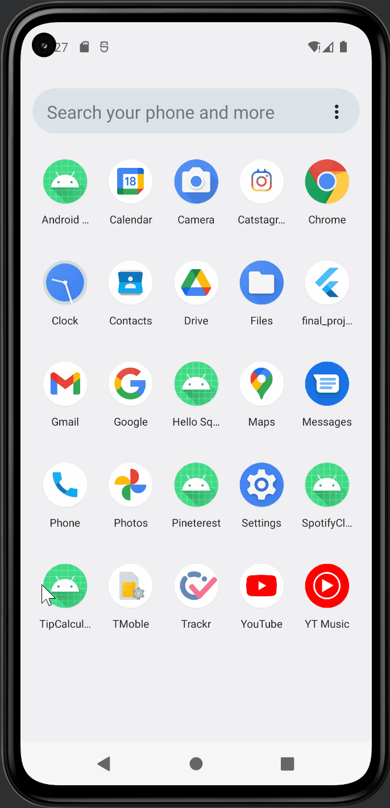

<!-- (This is a comment) INSTRUCTIONS: Go through this page and fill out any **bolded** entries with their correct values.-->

# AND101 Project 4 - CodeMath

Submitted by: **Minh Ngoc Vu**

Time spent: **3** hours spent in total

## Summary

**TipCalculator** is an android app that **calculates your tip**

If I had to describe this project in three (3) emojis, they would be: **🧐🔎🤯**

## Application Features

<!-- (This is a comment) Please be sure to change the [ ] to [x] for any features you completed.  If a feature is not checked [x], you might miss the points for that item! -->

The following REQUIRED features are completed:

- [x] At least one (1) user input
- [x] At least one (1) interactive View
- [x] At least one (1) output of a calculation based on the user input

The following STRETCH features are implemented:

- [x] Implement ViewBinding to reduce boilerplate code and increase efficiency
- [x] Add at least one (1) additional functionality

The following EXTRA features are implemented:

- [ ] List anything else that you added to improve the app!

## Video Demo

Here's a video / GIF that demos all of the app's implemented features:

GIF created with **ScreenToGif**

<!-- Recommended tools:
- [Kap](https://getkap.co/) for macOS
- [ScreenToGif](https://www.screentogif.com/) for Windows
- [peek](https://github.com/phw/peek) for Linux. -->

## Notes

n/a

## License

Copyright **2024** **Minh Ngoc Vu**

Licensed under the Apache License, Version 2.0 (the "License");
you may not use this file except in compliance with the License.
You may obtain a copy of the License at

    http://www.apache.org/licenses/LICENSE-2.0

Unless required by applicable law or agreed to in writing, software
distributed under the License is distributed on an "AS IS" BASIS,
WITHOUT WARRANTIES OR CONDITIONS OF ANY KIND, either express or implied.
See the License for the specific language governing permissions and
limitations under the License.
